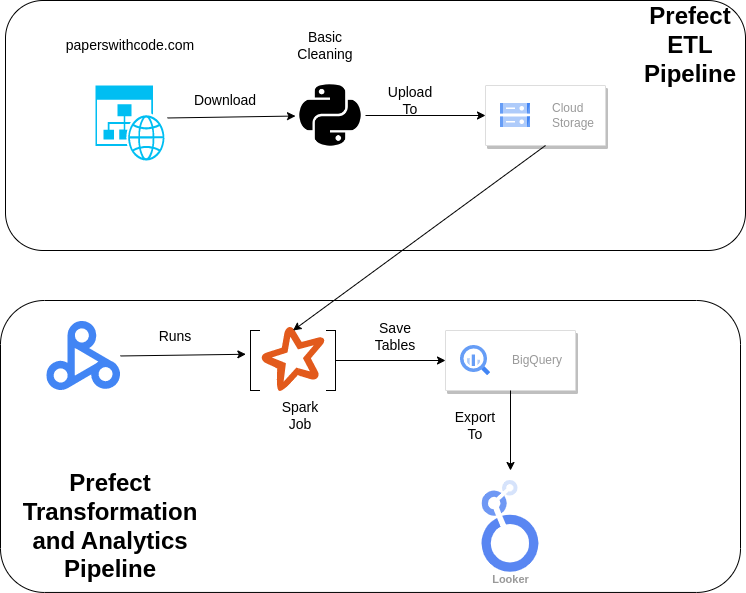

# de-paperswithcode

## Project Description
This is the final project for the Data Engineering Zoomcamp. The project aims to process and analyze the data provided by https://paperswithcode.com/. This well-known website collects the latest research papers in the AI field and provides code implementations for corresponding papers if any implementation is available. Also, the website benchmarks the solutions proposed for the same task on different datasets with regular updates on the results.

The website provides the data as JSON files, which can be found here: https://paperswithcode.com/about. This work will focus on three of the website data sources:
- Papers with abstracts
- Links between papers and code
- Datasets

and will analyze the following:
- **Papers** per **Task**
- **Datasets** per **Task**
- **Papers** per **Framework**
- **Papers** per **Proceeding**
- **Datasets** per **Language**

## Technologies
- Google Cloud Platform
    - Google Cloud Storage(GCS): Datalake
    - Dataproc: run PySpark jobs
    - BigQuery: DataWarehouse to manage and store created tables
    - Looker Studio: create report and dashboards
- Terraform: create and manage the infrastructure, the following resources are required:
    - GCS bucket
    - Dataproc cluster
    - BigQuery Dataset
- Prefect: Workflow orchestration, to create scheduled end-to-end data pipelines
- PySpark: Batch Processing

## Data Pipeline

We have two pipelines:
- Data ingestion pipeline(ETL): download the data, clean then store into the datalake
- Data transformation pipeline: uses **dataproc** to run pyspark job that transforms the data and then uploads the created tables into BigQuery



## Setup

The project uses python3.9.  
1- Create virtual environment and install requirements:
```
python3.9 -m venv venv
source venv/bin/activate
pip install -U pip
pip install -r requirements.txt
```

2- Before start:
- Install Terrafrom
- Enable the required GCP services and local setup of gcloud
- Install Docker and login to your dockerhub

3- Export environment variables in [env-vars.yml](env-vars.yml) with proper values, all variables are required.
- ```dataproc_temp_bucket``` will be available once the dataproc cluster is created. export it's value after creating the cluster, it's value can be found in the cluster configuration in GCP.

4- Create the infrastructure using Terraform, then ```export dataproc_temp_bucket=VALUE-FROM-CLUSTER-GCP```  

5- Login to Prefect cloud or run Prefect orion server, then create Prefect blocks from the UI, make sure to name the blocks as the names stated in the parameters for Prefect deployments in ```deployment.py```:
- Two Docker Container blocks, one for each Prefect deployment.
- GCP Credentials block
- GCS Bucket block
- GitHub block

6- Create the Prefect deployments: run ```make all``` this will create and push docker images to dockerhub, and apply the Prefect deployemnts.  

all steps are summarized here:
```
# export the environment variables:
export GOOGLE_APPLICATION_CREDENTIALS=""
export timezone=""
export TF_VAR_project_id=""
export TF_VAR_region=""
export TF_VAR_datalake_bucket_name=""
export TF_VAR_bq_dataset_name=""
export TF_VAR_dataproc_cluster_name=""
export datalake_docker_image_name=""
export spark_docker_image_name=""

# create infrastructure:
cd terraform
terrafrom init
terrafrom plan
terrafrom apply

cd ..
export dataproc_temp_bucket="VALUE-FROM-CLUSTER-GCP"

# login to Prefect cloud, then create the blocks:
prefect cloud login

# push docker images and apply deployments:
make all
```

Prefect agent(default agent) should be up and running. Note: this is not included in creating the infrastructure by Terraform. The instance that runs the agent should have enough RAM memory, at least **6GB** RAM.


## Limitations and TODO's
- Include the creation of VM instance that runs Prefect agent
- Dataproc cluster need to be running before submitting pyspark job, one improvement is to schedule the starting and stopping of the cluster
- Merge the two pipelines into one larger pipeline, that after uploading data into gcs; spark job gets submitted
- Control the data version in the datalake and datawarehouse, currently new data overwrites older data

## Report and Dashboard
The dashboard is created using looker studio, take a look [here](https://lookerstudio.google.com/reporting/940c7ff4-34c3-4d89-aed3-41c0f80cf3ae). The report is divided into Five pages.